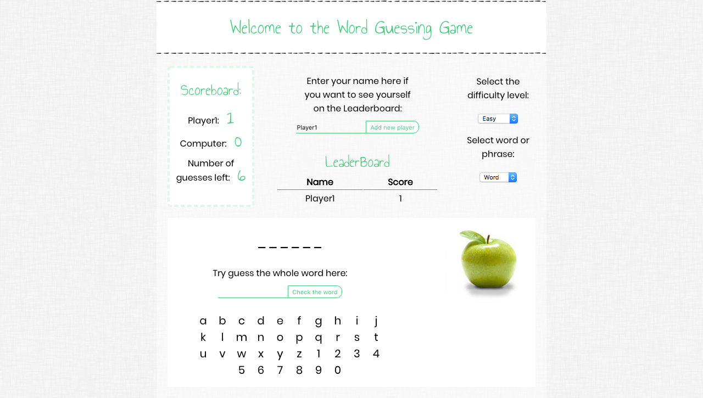

# Word guessing game

This is a word guessing game, which can be played by a user "against" the computer. This is a game where the computer thinks of a word, and the user tries to guess it one letter at a time. The guesser has six guesses. If the guesser guesses a letter which is part of the word, the secret-keeper will reveal all occurrences of that letter in the word. If the guesser guesses a correct letter such that all letters are now revealed, the game is over and the user has won. Instead if the user runs out of guesses before the whole word is discovered, the game is over and the computer has won.

Features:

- The length of the secret word is displayed to the guesser as a set of underscores
- As the guesser makes correct guesses, occurrences of the guessed letter in the word are shown while unknown letters are still hidden
- The number of guesses remaining is displayed
- All letters that have been guessed (right and wrong) are displayed to the user
- The game retrieves a dictionary list of words from the word dictionary REST API
- User can see scores over time and a leaderboard
- Game supports for guessing full words instead of just letters one at a time
- Game supports for phrases as well
- User can click on the letters and numbers as well as use keyboard
- User can see a diagram that changes as the user guesses incorrectly
- There are settings for “difficulty level” and type of word of phrase
- Error handling is implemented, so user can see a message if he uses special character, try to check empty string ot enter emty user name.
- User can restart the game in the end and enter new name to keep all the score of different users.
- If user refreshes the page all information is removed
